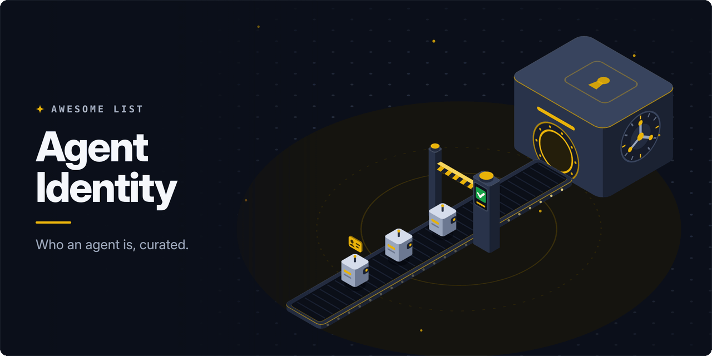

<!-- awesome:hero --><!-- /awesome:hero -->

<!-- awesome:title --><h1 align="center">Awesome Agent Identity</h1><!-- /awesome:title -->

<!-- awesome:tagline -->Identity, authentication and authorization for AI agents: agent IDs, delegated OAuth, credential brokers, workload identity and policy.<!-- /awesome:tagline -->

<!-- awesome:badges -->

  
  
  

<!-- /awesome:badges -->

Agent identity is how an AI agent proves who it is, whose authority it acts on, and what it may touch. This list covers the standards, identity providers, delegated access, MCP authorization, workload identity, policy engines and credential brokers built for that job.

## Contents

- [Standards and specs](#standards-and-specs)
- [Identity providers](#identity-providers)
- [Access governance](#access-governance)
- [Open-source agent identity](#open-source-agent-identity)
- [Delegated access](#delegated-access)
- [MCP authorization](#mcp-authorization)
- [Workload identity](#workload-identity)
- [Authorization and policy](#authorization-and-policy)
- [Credential brokers and vaults](#credential-brokers-and-vaults)
- [Reading](#reading)
- [Contributing](#contributing)

## Standards and specs

- [A2A enterprise features](https://a2a-protocol.org/latest/topics/enterprise-ready/) - Agent2Agent spec section on how agents authenticate and authorize each other.
- [Agent Auth Protocol](https://github.com/better-auth/agent-auth-protocol) - Open spec for agent registration, capability grants and service discovery.
- [Agent Identity, Trust and Lifecycle Protocol](https://datatracker.ietf.org/doc/draft-larsson-aitlp/) - IETF draft for agent naming, certificates, mandates and lifecycle states.
- [Agent Name Service](https://datatracker.ietf.org/doc/draft-narajala-ans/) - IETF draft for a DNS-based agent directory backed by PKI certificates.
- [Agent Passport System](https://datatracker.ietf.org/doc/draft-pidlisnyi-aps/) - IETF draft for agent identity, narrowing delegation, revocation and evidence of actions.
- [AI Identity Management System](https://datatracker.ietf.org/doc/draft-ietf-wimse-aims/) - WIMSE working group draft that applies WIMSE and OAuth to agent authentication.
- [auth.md](https://github.com/workos/auth.md) - WorkOS protocol where a Markdown file on a domain tells agents how to register for users.
- [ERC-8004](https://eips.ethereum.org/EIPS/eip-8004) - Ethereum standard for on-chain agent identity, reputation and validation registries.
- [Identity Assertion JWT Authorization Grant](https://datatracker.ietf.org/doc/draft-ietf-oauth-identity-assertion-authz-grant/) - OAuth draft behind Cross App Access, where the SSO provider grants an agent API access.
- [OAuth 2.0 Protected Resource Metadata](https://www.rfc-editor.org/rfc/rfc9728) - RFC 9728, how a resource names its authorization server; MCP servers use it.
- [OAuth 2.0 Token Exchange](https://www.rfc-editor.org/rfc/rfc8693) - RFC 8693, the token swap that on-behalf-of and agent delegation chains build on.
- [OAuth 2.1](https://datatracker.ietf.org/doc/draft-ietf-oauth-v2-1/) - Consolidated OAuth draft with PKCE required, the base of MCP authorization.
- [OAuth Client ID Metadata Document](https://datatracker.ietf.org/doc/draft-ietf-oauth-client-id-metadata-document/) - OAuth draft where a client ID is a URL to its metadata, used by MCP clients.
- [On-Behalf-Of User Authorization for AI Agents](https://datatracker.ietf.org/doc/draft-oauth-ai-agents-on-behalf-of-user/) - OAuth extension draft that names and authenticates the agent acting for a user.
- [Transaction Tokens](https://datatracker.ietf.org/doc/draft-ietf-oauth-transaction-tokens/) - OAuth draft for short-lived tokens that carry identity and context across a call chain.
- [Trusted Agent Protocol](https://github.com/visa/trusted-agent-protocol) - Visa spec for merchants to verify signed requests from shopping agents.
- [Verifiable Intent](https://github.com/agent-intent/verifiable-intent) - Open spec for cryptographic proof that a user authorized an agent's purchase.
- [W3C AI Agent Protocol Community Group](https://www.w3.org/community/agentprotocol/) - W3C group working on agent discovery, identity and collaboration on the web.
- [Web Bot Auth](https://datatracker.ietf.org/doc/draft-meunier-web-bot-auth-architecture/) - IETF draft where bots and agents sign HTTP requests so sites can verify the sender.
- [WIMSE working group](https://datatracker.ietf.org/wg/wimse/about/) - IETF group on workload identity across systems, home of the AIMS draft.

## Identity providers

- [Amazon Bedrock AgentCore Identity](https://docs.aws.amazon.com/bedrock-agentcore/latest/devguide/identity.html) - AWS service that gives agents identities and holds their OAuth tokens and API keys.
- [Auth0 for AI Agents](https://auth0.com/ai) - User login, Token Vault, async approval and fine-grained access for agent apps.
- [Descope Agentic Identity Hub](https://www.descope.com/use-cases/ai) - Auth, access control, credential storage and SSO for AI agents and MCP servers.
- [Google Cloud Agent Identity](https://cloud.google.com/agent-builder/agent-engine/agent-identity) - Per-agent identities for agents that run on Google Cloud's agent runtime.
- [Keycard](https://www.keycard.sh) - Runtime authorization that gives each agent an identity and scoped access under policy.
- [Microsoft Entra Agent ID](https://learn.microsoft.com/en-us/entra/agent-id/identity-platform/what-is-agent-id) - Entra identity type for AI agents, with sign-in, access policy and lifecycle.
- [Okta for AI Agents](https://www.okta.com/products/govern-ai-agent-identity/) - Registers agents in the Okta directory to discover, govern and revoke their access.
- [Stytch Connected Apps](https://stytch.com/connected-apps) - Turns your app into an OAuth provider so agents and MCP clients can sign in.
- [WorkOS AuthKit for MCP](https://workos.com/mcp) - OAuth 2.1 sign-in, scopes and tool permissions for MCP servers.

## Access governance

- [Astrix Security](https://astrix.security/product/secure-ai-agents/) - Finds AI agents and other non-human identities, trims privileges and flags threats.
- [Frontegg AgentLink](https://frontegg.com/product/agentlink) - Finds agents, brokers their connections and governs each action at runtime.
- [Natoma](https://natoma.ai/use-cases/secure-agent-access) - Governed access layer between AI clients or agents and company apps and data.
- [Oasis Agentic Access Management](https://www.oasis.security/agentic-access-management) - Brokers short-lived, intent-scoped access for agents with no standing permissions.
- [Ory Agent Security](https://www.ory.com/agent-security) - Control plane that authenticates, authorizes and audits AI coding agents.
- [SailPoint Agent Identity Security](https://www.sailpoint.com/products/agent-identity-security) - Identity governance for AI agents: inventory, owners, access reviews and controls.
- [Strata Maverics](https://www.strata.io/maverics-platform/identity-orchestration-for-ai-agents/) - Identity orchestration for human-to-agent, agent-to-MCP and multi-agent calls.
- [Token Security](https://token.security/product/mcp-server-and-ai-agent) - Finds agents and MCP servers, maps what they can reach and right-sizes access.

## Open-source agent identity

- [Agent Identity Management](https://github.com/opena2a-org/agent-identity-management) - OpenA2A service for cryptographic agent IDs, capability grants and audit trails.
- [Agent Name Service registry](https://github.com/agentnameservice/ans-registry) - Registry that binds agents to verified domains with versioned certificates and a log.
- [Agent Passport System SDK](https://github.com/agent-passport-system/agent-passport-system) - TypeScript SDK for agent passports, narrowing delegation and signed receipts.
- [AGNTCY Identity](https://github.com/agntcy/identity) - Issues and verifies IDs for agents and MCP servers with verifiable credentials.
- [Attestix](https://github.com/VibeTensor/attestix) - DID-based agent identity and verifiable credentials with compliance records.
- [Better Auth Agent Auth](https://github.com/better-auth/agent-auth) - Server plugin, client SDK and CLI that implement the Agent Auth Protocol.
- [Casdoor](https://github.com/casdoor/casdoor) - Open-source IAM and auth server with agent identities and an MCP gateway.
- [Open Agent Auth](https://github.com/alibaba/open-agent-auth) - Alibaba framework that binds agent operations to user identity with scoped grants.
- [ThunderID](https://github.com/thunder-id/thunderid) - Lightweight IAM stack that treats agents as first-class identities with delegation.
- [vestauth](https://github.com/vestauth/vestauth) - CLI that gives agents a Web Bot Auth identity and signs their HTTP requests.
- [Web Bot Auth libraries](https://github.com/cloudflare/web-bot-auth) - Cloudflare code to sign and verify bot and agent HTTP requests.
- [ZeroID](https://github.com/highflame-ai/zeroid) - Issues short-lived agent credentials with delegation, attestation and revocation.

## Delegated access

- [Arcade](https://www.arcade.dev) - Runtime that executes agent tool calls with per-user OAuth and permission checks.
- [Auth0 AI SDK](https://github.com/auth0/auth0-ai-js) - JavaScript SDK that adds Token Vault, async approval and FGA to agent frameworks.
- [Auth0 Token Vault](https://auth0.com/docs/secure/tokens/token-vault) - Stores users' third-party tokens so agents can call those APIs for them.
- [Composio](https://github.com/ComposioHQ/composio) - Tool platform that handles per-user auth to hundreds of apps for agents.
- [Jentic One](https://github.com/jentic/jentic-one) - Self-hosted broker that checks agent permissions and attaches API credentials per call.
- [Nango](https://github.com/NangoHQ/nango) - Open-source managed OAuth and API access to hundreds of apps for agents and products.
- [OpenConnector](https://github.com/oomol-lab/open-connector) - Self-hosted connector gateway that keeps users' app credentials out of agents.
- [Pipedream Connect](https://pipedream.com/connect) - Managed user auth and prebuilt tools across thousands of APIs for agents.
- [Scalekit AgentKit](https://www.scalekit.com/agent-auth) - Per-user auth and tool calling for agents across hundreds of connectors.
- [Zalando Agentic Identity Broker](https://github.com/zalando-incubator/agentic-identity-broker) - Broker for on-behalf-of delegation chains, user consent and a token vault.

## MCP authorization

- [Authplane](https://github.com/AuthPlane/authserver) - Self-hosted OAuth authorization server built for the MCP authorization spec.
- [Clerk MCP Tools](https://github.com/clerk/mcp-tools) - Library that adds OAuth to MCP clients and servers on the TypeScript SDK.
- [FastMCP authentication](https://gofastmcp.com/servers/auth/authentication) - FastMCP guide to securing servers with tokens or OAuth through an outside IdP.
- [Keycloak for MCP](https://www.keycloak.org/securing-apps/mcp-authz-server) - Keycloak guide to acting as the authorization server for MCP servers.
- [MCP Auth](https://github.com/mcp-auth/js) - Node.js SDK that connects MCP servers to an existing OAuth or OIDC provider.
- [MCP Auth Proxy](https://github.com/sigbit/mcp-auth-proxy) - Drop-in OAuth 2.1 and OIDC proxy in front of any MCP server, no code changes.
- [MCP auth reference servers](https://github.com/Azure-Samples/mcp-auth-servers) - Microsoft samples that show how MCP server auth works under the current spec.
- [MCP authorization extensions](https://github.com/modelcontextprotocol/ext-auth) - Optional MCP auth add-ons: enterprise-managed authorization and client credentials.
- [MCP authorization spec](https://modelcontextprotocol.io/specification/latest/basic/authorization) - The MCP spec's OAuth rules for how clients get access to servers.
- [mcp-front](https://github.com/stainless-api/mcp-front) - Auth gateway that lets a team reach internal MCP servers with their own sign-in.
- [mcp-oauth](https://github.com/giantswarm/mcp-oauth) - Go library that implements an OAuth 2.1 authorization server for MCP servers.
- [mcp-oauth-proxy](https://github.com/obot-platform/mcp-oauth-proxy) - Obot proxy that authenticates clients with OAuth 2.1 before MCP traffic.
- [oauth-mcp-proxy](https://github.com/tuannvm/oauth-mcp-proxy) - OAuth 2.1 library for Go MCP servers with several identity providers.
- [Permit FastMCP middleware](https://github.com/permitio/permit-fastmcp) - Checks each FastMCP tool call against Permit.io policies.
- [Workers OAuth Provider](https://github.com/cloudflare/workers-oauth-provider) - Cloudflare library that wraps a Worker, such as a remote MCP server, in OAuth.

## Workload identity

- [Aembit](https://aembit.io/iam-for-agentic-ai/) - Workload IAM that gives agents short-lived, policy-based access with no stored secrets.
- [identity-spiffe](https://github.com/microsoft/identity-spiffe) - Microsoft sample of agent-to-agent authorization with Entra Agent ID and SPIFFE.
- [kontxt](https://github.com/aramase/kontxt) - Transaction Tokens for Kubernetes that carry identity and context across agent hops.
- [SPIFFE](https://spiffe.io/) - CNCF standard for workload identity that agent-as-workload models build on.
- [SPIRE](https://github.com/spiffe/spire) - Reference SPIFFE runtime that attests workloads, agents included, and issues their IDs.
- [Teleport Machine & Workload Identity](https://goteleport.com/platform/machine-and-workload-identity/) - Short-lived certificates for machines, workloads and agents in place of secrets.

## Authorization and policy

- [Amazon Bedrock AgentCore Policy](https://docs.aws.amazon.com/bedrock-agentcore/latest/devguide/policy.html) - AWS service that checks agent tool calls against Cedar policies.
- [Caracal](https://github.com/Garudex-Labs/caracal) - Gateway that gives agents signed, narrowing mandates and injects credentials per action.
- [Cerbos](https://github.com/cerbos/cerbos) - Policy decision point that authorizes app users and AI agents down to each action.
- [Clawvisor](https://github.com/clawvisor/clawvisor) - Gatekeeper where users approve an agent's task scope and it injects credentials.
- [Eunomia](https://github.com/whataboutyou-ai/eunomia) - Authorization layer for agents with policy middleware for MCP servers.
- [Microsoft Agent Governance Toolkit](https://github.com/microsoft/agent-governance-toolkit) - Policy enforcement, zero-trust agent identity and sandboxing for agent frameworks.
- [node9](https://github.com/node9-ai/node9-proxy) - Local proxy that sets what coding agents and MCP servers may do and holds risky calls.
- [OpenFGA](https://github.com/openfga/openfga) - Zanzibar-style authorization engine often used to scope what agents and RAG can see.
- [Oso for Agents](https://www.osohq.com/docs/oso-for-agents/overview) - Oso Cloud feature to find, monitor and limit what AI agents can do.
- [Permit.io](https://www.permit.io/ai-access-control) - RBAC, ABAC and ReBAC checks on prompts, tool calls, responses and data for AI apps.
- [Permit0](https://github.com/permit0-ai/permit0) - Policy engine that scores each agent action against risk rules before it runs.
- [Tenuo](https://github.com/tenuo-ai/tenuo) - Signed, task-scoped warrants that limit which tools an agent may call and how.

## Credential brokers and vaults

- [1Password for agentic AI](https://1password.com/solutions/agentic-ai) - 1Password features for agent sign-in and controlled access to stored credentials.
- [2password](https://github.com/kitlangton/2password) - 1Password CLI wrapper that lets coding agents use and save secrets unseen.
- [Aegis](https://github.com/getaegis/aegis) - Local proxy that adds API keys to agent requests in transit, with domain guards.
- [Agent Access](https://github.com/bitwarden/agent-access) - Bitwarden protocol, CLI and SDK that hand agents single credentials, not the vault.
- [Agent Vault](https://github.com/Infisical/agent-vault) - Infisical HTTP proxy and vault that injects credentials for coding and custom agents.
- [agent-creds](https://github.com/dtkav/agent-creds) - Sandbox where Envoy and Vault swap an agent's capability token for the real key.
- [AgentSecrets](https://github.com/The-17/agentsecrets) - Credential store that injects secrets by key name so agents never hold the values.
- [Authsome](https://github.com/agentrhq/authsome) - Credential gateway that keeps agents signed in through OAuth2 or API keys.
- [Gap](https://github.com/mikekelly/gap) - Local proxy that injects account credentials so agents only hold a Gap token.
- [HASP](https://github.com/gethasp/hasp) - Local secret broker that gives agent commands only the values they may use.
- [keypo-cli](https://github.com/keypo-us/keypo-cli) - Secure Enclave keys and an encrypted vault that inject secrets for agents on a Mac.
- [octobroker](https://github.com/openabdev/octobroker) - GitHub gateway that lets coding agents call tools and push with no GitHub credential.
- [psst](https://github.com/Michaelliv/psst) - Secrets manager that lets agents use secrets without reading their values.
- [Sallyport](https://github.com/OlegSotnikov/sallyport) - Mac vault that runs authenticated API and SSH actions for agents over MCP.
- [Sigcli](https://github.com/sigcli/sigcli) - CLI and proxy that signs in through browser SSO and injects credentials for agents.
- [Varlock](https://github.com/dmno-dev/varlock) - Schema-driven .env tool that keeps secret values out of agent context.

## Reading

- [AI agent identity with HashiCorp Vault](https://developer.hashicorp.com/validated-patterns/vault/ai-agent-identity-with-hashicorp-vault) - HashiCorp pattern for agent auth with short-lived Vault dynamic secrets.
- [AuthFlowMap](https://github.com/Jinssi/AuthFlowMap) - Interactive step-by-step map of OAuth, Entra Agent ID and MCP auth flows.
- [Identity Management for Agentic AI](https://openid.net/wp-content/uploads/2025/10/Identity-Management-for-Agentic-AI.pdf) - OpenID Foundation paper on agent identity, delegation and open problems.
- [Know Your Agent: Agent Identity Infrastructure](https://reports.tiger-research.com/p/2026-know-your-agent-eng) - Tiger Research report comparing competing approaches to agent identity.
- [Let's fix OAuth in MCP](https://aaronparecki.com/2025/04/03/15/oauth-for-model-context-protocol) - Aaron Parecki on separating MCP servers from authorization servers.
- [OWASP Non-Human Identities Top 10](https://owasp.org/www-project-non-human-identities-top-10/) - The top risks for service accounts, tokens and other machine credentials.
- [Web Bot Auth introduction](https://blog.cloudflare.com/web-bot-auth/) - Cloudflare post on signing agent requests with HTTP message signatures.

## Contributing

Contributions are welcome. Read the [contribution guidelines](contributing.md) first.

<!-- awesome:maintainer -->
Maintained by [Ian Wiedenman](https://github.com/ianwieds).
<!-- /awesome:maintainer -->
